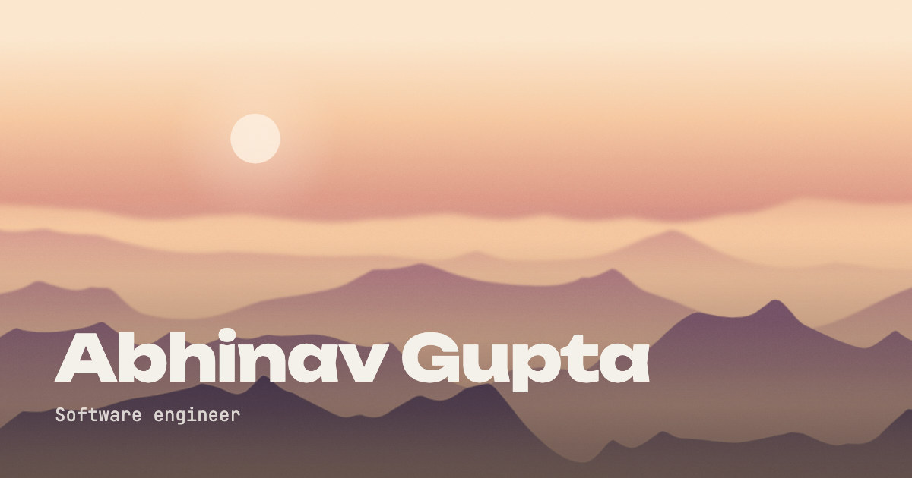

# Abhinav Gupta — Portfolio

Abhinav Gupta's personal site: one continuous, scroll-driven scene rather than a
page of stacked sections.

**Live:** [abgupta.vercel.app](https://abgupta.vercel.app)




The whole site sits on a single full-bleed scene: mountain ridges under
drifting haze, with a sun (or at night, a moon) in the sky. Every scroll delta
stages the next beat of that scene instead of paging through sections. The
site is being rebuilt one layer at a time. `0.1.x` built the atmosphere,
and `0.2.x` starts the camera moving as you scroll. Content, projects and
contact come in later lines (see [Versioning](#versioning)).

## Contents

- [Features](#features)
- [Tech stack](#tech-stack)
- [Getting started](#getting-started)
- [Scripts](#scripts)
- [Configuration](#configuration)
- [Debug and test URL hooks](#debug-and-test-url-hooks)
- [Project structure](#project-structure)
- [Architecture](#architecture)
- [Performance and accessibility](#performance-and-accessibility)
- [Browser support](#browser-support)
- [Versioning](#versioning)
- [Deployment](#deployment)
- [Contributing](#contributing)
- [License](#license)
- [Contact](#contact)

## Features

**The atmosphere** (`0.1.x`)

- A WebGL2 renderer draws the mountain scene. Where WebGL2 is missing or fails,
  a layered DOM renderer draws the same scene from stacked CSS layers.
- Click the sun to turn the sky. Dusk to night (1.5s): the sun sets behind the
  ridges as the moon rises, through a blue hour. Night to dusk (4s): the moon
  fades with the morning while the sun crosses the sky, through dawn, day and
  late afternoon. The ridges reshape and are relit the whole way.
- At rest the ridges slowly drift, over about a minute (WebGL only).
- The theme is remembered across visits and set before first paint, so a night
  visitor never sees a day flash.
- The scene is mounted once in the root layout, so it keeps running across
  routes, including the 404.
- Reduced motion freezes the haze and turns the sky switch into a cut.

**Scroll** (new in `0.2`)

- Smooth wheel scrolling with [Lenis](https://lenis.darkroom.engineering) on
  desktop, loaded after first paint so it stays out of first-load JS. Touch
  devices scroll natively, and keyboard scrolling stays native everywhere.
- Scroll progress drives a camera that pulls back from the mountains with a
  slight tilt, with a faint strip of sky above and a little meadow at the
  bottom. Since `0.2.1` the ridges behave like terrain: each keeps its
  silhouette, the front one recedes as a new one slides up from below, and
  distant ranges rise from behind the far ridge. Since `0.2.2` distance
  reads as air: far ranges step into the haze, warm light catches the crests
  in the sun's column, and the ridges keep breathing at every scroll
  position. Since `0.2.3` the sun and moon can be clicked at any scroll
  position, and a switch mid-scroll blends with the camera. Since `0.2.4`
  the WebGL renderer skips ridges hidden behind nearer ones, caps and adapts
  its resolution, and redraws less at rest, so large high-DPI laptops hold
  full frame rate. Next, `0.2.5` brings the crest light to the resting
  scene. The layered fallback still runs the `0.2.0` camera and catches up in
  `0.2.6` (see [`ROADMAP.md`](./ROADMAP.md)).
- Time of day moves with scroll. By day the sky turns from golden hour to
  sunset and the sun sets into the ridges; by night the moon sinks too,
  warming toward amber.
- The sun toggle's hit target follows the painted sun or moon at every
  scroll position.

## Tech stack

- [Next.js 16](https://nextjs.org) (App Router) and React 19, in plain JS/JSX
  (no TypeScript)
- A hand-written WebGL2 renderer (fragment shaders, no three.js), with a
  layered DOM fallback
- [Lenis](https://lenis.darkroom.engineering) for smooth scrolling.
  [GSAP](https://gsap.com) is installed for later scroll choreography.
- Plain CSS: CSS Modules per component, global tokens and reset in
  `app/globals.css`. No Tailwind.
- Fonts via `next/font/google`: Unbounded (display) and JetBrains Mono
  (body and labels)
- [Playwright](https://playwright.dev) for the renderer parity and performance
  harness

## Getting started

**Prerequisites:** Node.js 20.9.0 or newer (Next.js 16's `engines`
requirement) and npm.

```bash
git clone <this repository>
cd Portfolio
npm install
npm run dev        # http://localhost:3000
```

For a production build:

```bash
npm run build
npm run start      # serves the build on http://localhost:3000
```

The parity and perf scripts drive a real browser through Playwright. If
Chromium isn't installed yet, run `npx playwright install chromium` first.

## Scripts

| Script | What it does |
|---|---|
| `npm run dev` | Starts the Next.js dev server |
| `npm run build` | Builds for production |
| `npm run start` | Serves the production build |
| `npm run test` | Runs `playwright test`. There are no Playwright specs in the repo yet, so it currently finds nothing to run. |
| `npm run parity` | Compares the layered renderer against WebGL, pixel by pixel, across viewports, both themes and three scroll positions (`--scrolls`, default top, middle and end). Fails above a mean difference of 2/255 or a p99 of 24. |
| `npm run perf` | Measures frame timing and main-thread time per renderer, during sky switches, at rest and through a scroll sweep |

Run `parity` and `perf` against a production server, not `next dev`. Flags,
output and how to read the numbers are in
[`scripts/README.md`](./scripts/README.md).

## Configuration

The site's canonical URL (used by metadata, JSON-LD, `robots.txt`,
`sitemap.xml` and `llms.txt`) comes from config, not code. `app/site.js`
resolves it in this order:

| Variable | Meaning |
|---|---|
| `SITE_URL` | Overrides everything, e.g. to pick one of several production domains |
| `VERCEL_PROJECT_PRODUCTION_URL` | Set by Vercel on every build: the project's primary production domain, used as `https://<domain>` |
| *(neither set)* | Falls back to `http://localhost:3000` |

No other environment variables are needed to run the site, and none are
required locally. To set one, copy [`.env.example`](./.env.example) to
`.env.local`.

## Debug and test URL hooks

Query parameters the scene honours, mostly for the harness and screenshots:

| Parameter | Effect |
|---|---|
| `?renderer=gl` / `?renderer=layers` | Force a renderer |
| `?freeze=1` | Hold the haze at its rest phase (no drift, full opacity) |
| `?grain=0` | Drop the grain layer (grain is random per load) |
| `?crest=cpu` | WebGL only: compute the ridge outlines on the CPU instead of the GPU |
| `?driftAt=0.25` | WebGL only: pin the idle ridge drift, even with `?freeze=1` |
| `?scroll=0.5` | Pin scroll progress (0 to 1), so a test can capture a scrolled state without scrolling |

The scene also exposes `data-*` attributes for tests (which renderer painted,
where the sun is, whether a switch is running). They're listed in
[`CLAUDE.md`](./CLAUDE.md#renderers).

## Project structure

```
app/                 routes, metadata, JSON-LD, robots/sitemap/llms.txt, icons, share images
  layout.jsx         root layout: mounts the atmosphere and the scroll layer once
  page.jsx           home
  site.js            shared site facts (URL, name, role, links)
components/
  AtmosphereField.jsx  the scene behind every page; picks a renderer
  SmoothScroll.jsx     Lenis and the scroll progress the scene reads
  SunToggle.jsx        the click target on the painted sun
  scroll/              scroll progress store and the scroll track
  gradient/
    gl/              WebGL2 renderer and shaders
    layers/          layered DOM fallback
    recipes/         the day and night scenes, as data
styles/              global utilities
scripts/             renderer parity and perf harness
.env.example         optional environment variables
LICENSE              all rights reserved
```

The full, annotated tree is in [`CLAUDE.md`](./CLAUDE.md#project-structure).

## Architecture

**Scenes are data.** Nothing about the look lives in a renderer. Each scene is
a recipe file in `components/gradient/recipes/` (`dusk-ember.js` for day,
`moonlit.js` for night) holding the ridge shape, haze, sun position, colour
stops and grain, plus how a switch into that scene runs: its length, the arc
the sun and moon ride, and the skies it passes through on the way. Adding a
scene means adding a recipe and registering it in `themes.js`.

**Two renderers, one look.** The WebGL2 renderer composites the whole scene in
one fullscreen fragment shader, with the ridge outlines computed on the GPU
into a texture. The layered fallback draws the same scene as stacked DOM
layers, so the browser composites rather than repaints, with each ridge's
silhouette computed as a mask from the shader's own maths. Both are loaded
dynamically after mount, with a CSS gradient of the sky painted behind them
until they arrive. They share the switch maths (`orbit.js`), the camera maths
(`camera.js`), the sky ramp, and the sun and moon looks, and `npm run parity`
keeps them visually identical. Since `0.2.1` only the WebGL camera has moved
on (and in `0.2.2` its look under scroll), so they match at the top of the
page but not mid-scroll until the fallback catches up in `0.2.6` (before
`0.3`).

**One clock per job.** At rest, an exponential smoothing step holds the scene.
During a switch, one eased clock carries the sun and moon along their arc,
moves the palette through its keyframes, and reshapes the ridges together, so
nothing runs ahead of anything else. The sky interpolates its colours; it
never crossfades two layers.

**Scroll is one number.** The scroll layer publishes a single progress value
to a small store outside React, so a scroll frame never re-renders a
component. The renderers and the sun toggle subscribe to it.

The details, including the measured numbers behind these choices, are in
[`CLAUDE.md`](./CLAUDE.md#the-atmosphere).

## Performance and accessibility

- **Lean first load.** Both renderers and Lenis are loaded after first paint,
  so none of them is in first-load JS. The scroll layer itself adds about
  1.4 KB gzipped.
- **Cheap at rest.** The WebGL renderer redraws only when the haze has moved
  visibly, and caps ridge-drift updates at 60 per second. The layered fallback
  runs nothing on the main thread at rest: its haze drifts on the compositor.
- **Measured, not guessed.** `npm run perf` records frame times and
  main-thread cost per renderer; `npm run parity` catches any visual drift
  between them.
- **Reduced motion.** With `prefers-reduced-motion`, the haze holds still, a
  sky switch is a cut, Lenis doesn't load, and the scroll camera moves only
  part of the way.
- **Semantics.** The home page and the 404 each have one `<h1>` and an intro
  in the server-rendered HTML. The scene is decorative and hidden from assistive tech, except the
  sun, which is a real button.

## Browser support

| Browser | Version |
|---|---|
| Chrome / Edge (desktop and Android) | 111 or later |
| Safari (macOS and iOS/iPadOS) | 16.4 or later |
| Firefox | 111 or later |

These are Next.js 16's default targets, which the build compiles for. The
site's own features fit inside them: WebGL2, `lvh`/`svh` viewport units,
container query units (`cqh`) for the sun's hit target, CSS masks and
`OffscreenCanvas`. `requestIdleCallback` is used where it exists, with a timer
fallback for Safari.

**Renderers.** Any browser with WebGL2 gets the WebGL renderer. Without it, or
if the shader fails to build or the GL context is lost, the layered fallback
takes over (after a lost context, WebGL is retried a few times). The GPU crest
pass needs `EXT_color_buffer_float`, and without it the crests are computed on
the CPU with identical output.

**Tested in** Chromium and WebKit (Playwright), at phone, tablet, laptop and
ultrawide sizes. Firefox isn't in the automated runs. On touch devices the
page uses native scrolling; Lenis smooth scrolling is desktop only.

## Versioning

The site is rebuilt layer by layer, and the version line tracks which layer:

| Line | Scope |
|---|---|
| `0.1.x` | Background and atmosphere layer (done) |
| `0.2.x` | About me: the camera pulls back from the mountains (current) |
| `0.3.x` | Projects: the descent onto the desk and device |
| `0.4.x` | Contact |
| `0.5.x` | Header navigation across the sections |
| `0.6.x` | Real content throughout |
| `1.0.0` | Ship, once the hygiene gate in the roadmap is clear |

The plan past the current line will change. See [`ROADMAP.md`](./ROADMAP.md).

Commits follow [Conventional Commits](https://www.conventionalcommits.org),
with the version in the scope:

```
<type>(vX.Y.Z): <summary>

feat(v0.2.0): Stage the hero name reveal on first scroll
```

Types: `feat`, `fix`, `docs`, `style`, `refactor`, `perf`, `test`, `build`,
`chore`. The version matches `package.json` and the git tag.

## Deployment

The site is deployed on [Vercel](https://vercel.com). It needs no extra
configuration there: Vercel sets `VERCEL_PROJECT_PRODUCTION_URL`, which becomes
the canonical URL. Set `SITE_URL` if the project has more than one production
domain and a different one should be canonical.

Before a push, check a production build (`npm run build && npm run start`)
against the pre-push list in [`CLAUDE.md`](./CLAUDE.md#pre-push-checks).

## Contributing

This is a personal portfolio, so it isn't looking for feature contributions.
Bug reports are welcome as issues. If you open a pull request, keep it small
and follow the commit format above.

## License

Copyright © 2026 Abhinav Gupta. All rights reserved. The source is public to
read, but no license is granted: the code, design and content may not be
copied, modified or redistributed without permission. See [`LICENSE`](./LICENSE).

## Contact

Abhinav Gupta, software engineer. GitHub:
[@AbGisHere](https://github.com/AbGisHere).
